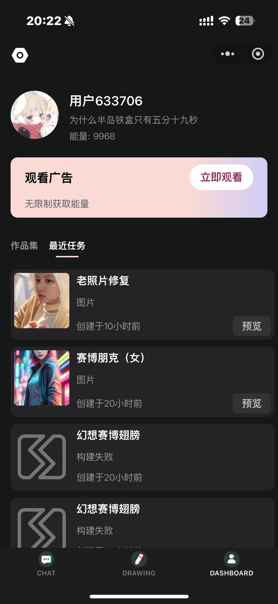
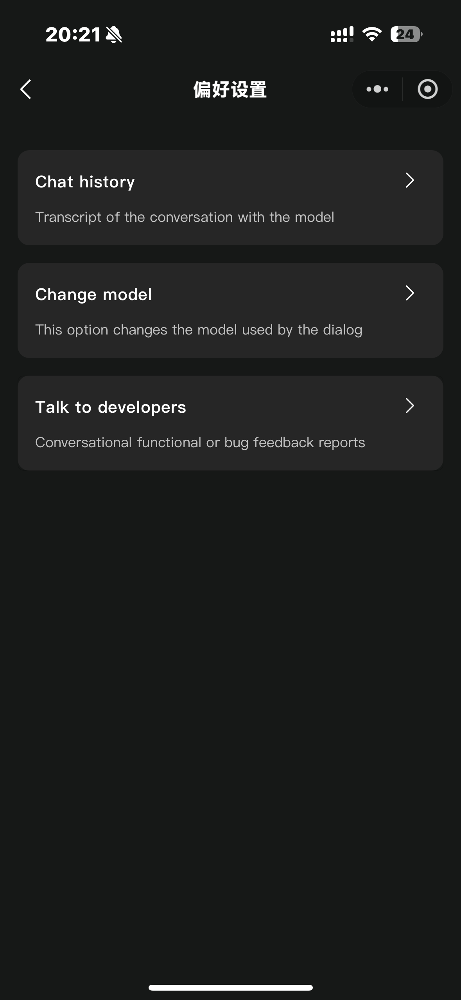
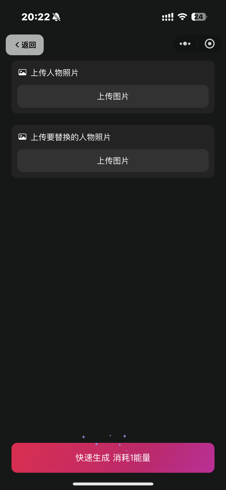
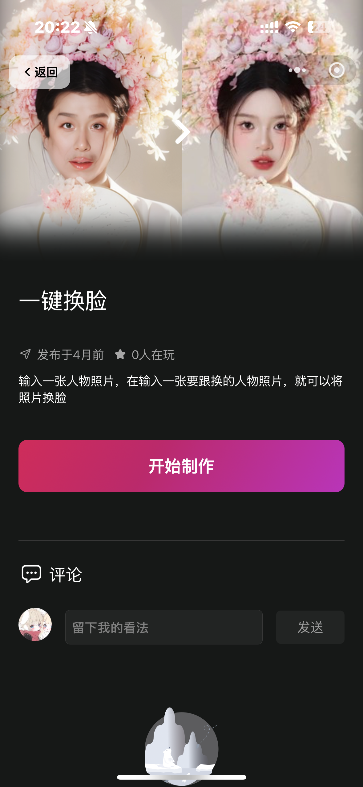
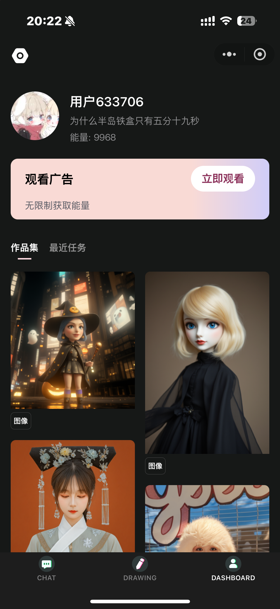
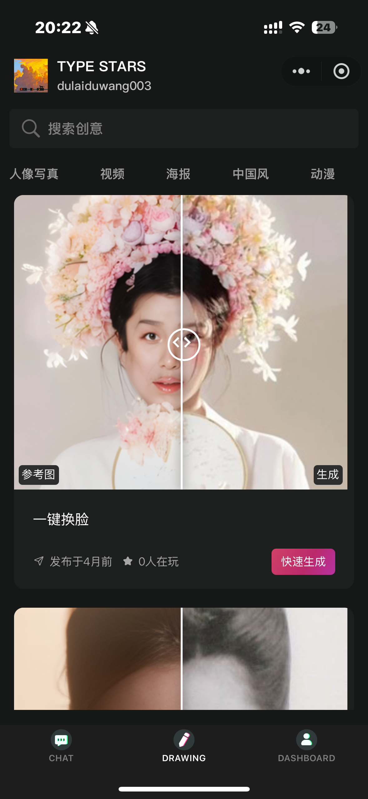
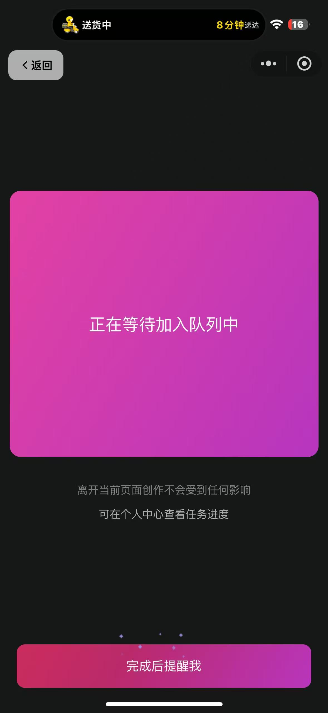
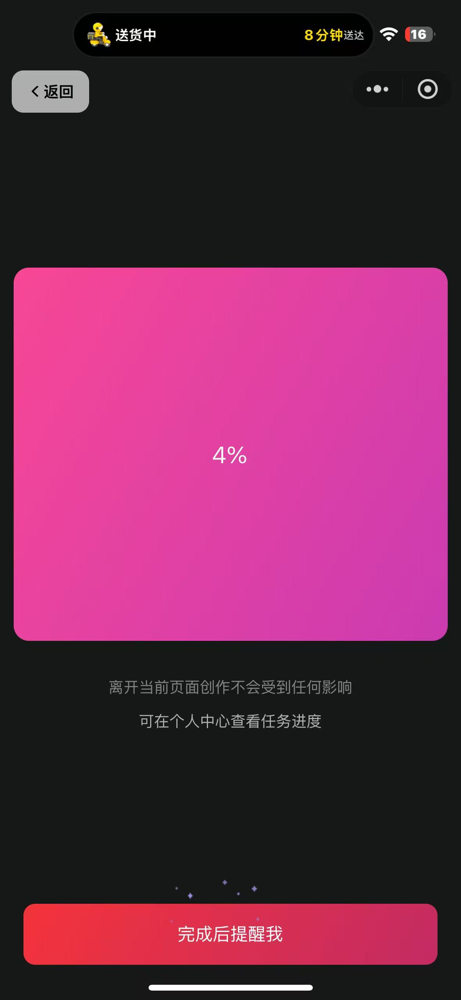
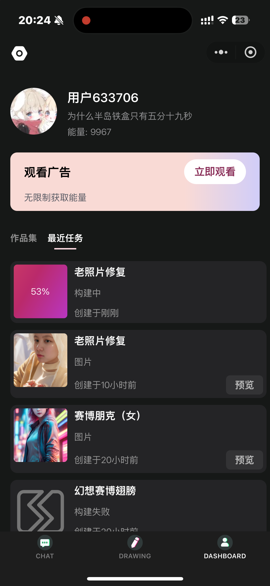
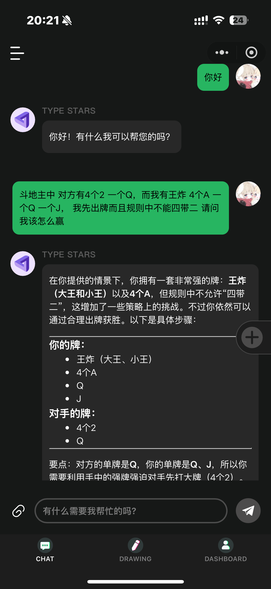

# TYPE STARS

### 项目说明

主要实现comfy-ui绘图绘图功能小程序应用，支持自定义工作流，生成视频、图片、3D模型、音频，支持实时展示任务进程、广告主
 
### 效果预览 （vpn预览）

### 项目部署

> 后端 singleton
> > - ### 部署环境
> > - `MySQL8+` `Java21+` `Maven3+` `Redis7+`
> > - ### 项目结构
> > - * ts-application 项目启动模块 (项目启动以及项目路由鉴权)
> > - * ts-chat ai对话服务模块 (Ai对话服务控制)
> > - * ts-common 公共组件服务模块 (整体项目公共组件以及对外暴露API)
> > - * ts-drawing 绘图服务模块 (整体项目绘图服务控制)
> > - * ts-system 后台服务模块 (未实装)
> > - ### 部署事项
> > - * 项目所使用的数据库表均存在于项目根目录中的 [.sql](.sql)目录
> > - * 请先修正[application-prod.yml](ts-application/src/main/resources/application-prod.yml)，建议先本地运行一下
> > - * Maven打包后从ts-application -> target 中获取 ts-application-1.0-SNAPSHOT.jar 部署即可
> > - * 修正项目环境后，建议先clean再package

> 小程序端 miniProgram
> > - ### 部署环境
> > - `NodeJs18+` `HBuild` `微信开发者工具`
> > - ### 部署事项
> > - * 运行 npm install 命令
> > - * 修正项目根目录中的 env.js文件

### TIPS

> 如何添加工作流呢？
> > 因为ts-system模块还在修正，所以请进群找群主问目前临时的工作流添加流程以及后续的一些问题

> 如果你理解能力较强请参考以下 最好还是找我因为你不知道我咋设计的
> > 因为ts-system模块还在修正，所以目前上传工作流方法寄存在了ts-drawing模块中，找到接口 `parsingWorkflowsJson解析工作流文件`
> > `updateWorkflows上传工作流接口`

### 如果项目对你有帮助支持一下吧~

